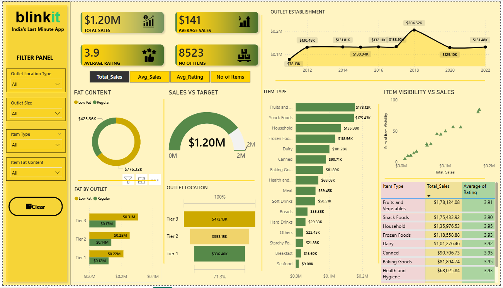

# Blinkit Sales Analysis Dashboard
## 1️⃣ Project Overview

This project presents an interactive sales analysis dashboard for Blinkit built using Microsoft Power BI.
The objective of this project is to transform raw retail sales data into actionable business insights using data modeling, DAX measures, and interactive visualizations.

The dashboard helps analyze product performance, outlet performance, and sales trends, enabling better data-driven decision-making.

## 2️⃣ Business Problem

Retail businesses need to understand:

Which products generate the most revenue

Customer preference patterns

Outlet performance across different tiers

Sales growth trends over time

Product visibility impact on sales

Without proper visualization, extracting these insights from raw data becomes difficult.

## 3️⃣ Project Objectives

The dashboard answers the following key questions:

Which product categories contribute most to overall sales?

How does fat content (Low Fat vs Regular) influence sales?

Which outlet tiers or sizes perform best?

What is the trend of sales across outlet establishment years?

Which products have high visibility but low sales?

What are the Top 10 product categories by sales and rating?

## 4️⃣ Tools & Technologies Used

Power BI

DAX (Data Analysis Expressions)

Power Query

Data Modeling

Data Visualization

## 5️⃣ Data Preparation

The following steps were performed during data preparation:

Data cleaning and transformation using Power Query

Handling missing values

Creating calculated columns

Creating DAX measures

Building relationships between tables

## 6️⃣ Data Modeling

Data modeling was performed to connect different tables and ensure accurate analysis.

Relationships were created between:

Item Data

Outlet Data

Sales Data

This allows Power BI to perform efficient aggregations and filtering.

## 7️⃣ Key Performance Indicators (KPIs)
KPI	Value
Total Sales	$1.20M
Average Sales	$141
Average Rating	3.9
Number of Items	8523

## 8️⃣ Dashboard Features

The dashboard contains the following visualizations:

Sales Trend

Shows how sales changed across outlet establishment years.

Sales by Fat Content

Compares Low Fat vs Regular products.

Sales vs Target

Gauge chart showing actual sales compared to target.

Sales by Item Type

Displays performance of different product categories.

Item Visibility vs Sales

Scatter plot analyzing relationship between visibility and sales.

Outlet Tier Performance

Comparison of sales between Tier 1, Tier 2, and Tier 3 outlets.

Outlet Location Contribution

Shows how much revenue each outlet tier contributes.

Interactive Filters

Users can filter dashboard data by:

Outlet Location Type

Outlet Size

Item Type

Item Fat Content

## 9️⃣ Dashboard Preview

## 🔟 Key Insights
Top Contributing Product Category

Fruits and Vegetables contribute the highest overall sales.

Fat Content Impact

Low-fat items generate higher sales than regular-fat products, showing a preference for healthier products.

Best Performing Outlet Tier

Tier 3 outlets perform the best with total sales of approximately $472K.

Sales Trend

Sales peaked in 2018 with approximately $204.52K.

Visibility vs Sales

There are no major products with high visibility but low sales, indicating effective product placement.

## 1️⃣1️⃣ Top 10 Product Categories by Sales

Fruits and Vegetables

Snack Foods

Household

Frozen Foods

Dairy

Canned

Baking Goods

Health and Hygiene

Meat

Soft Drinks

## 1️⃣2️⃣ Business Recommendations

Based on the analysis:

Increase inventory for Fruits and Vegetables due to high demand.

Promote low-fat products as customers prefer healthier options.

Expand Tier 3 outlets because they generate the highest sales.

Maintain strong product visibility strategies.

## 1️⃣3️⃣ Conclusion

The Blinkit Sales Dashboard provides a comprehensive overview of sales performance, product demand, and outlet efficiency.
It enables stakeholders to quickly identify trends, high-performing categories, and opportunities for business growth.

## 👤 Author
Vamsi Kumar Reddy
Aspiring Data Analyst | SQL | Python | PowerBi | Data Visualisation
